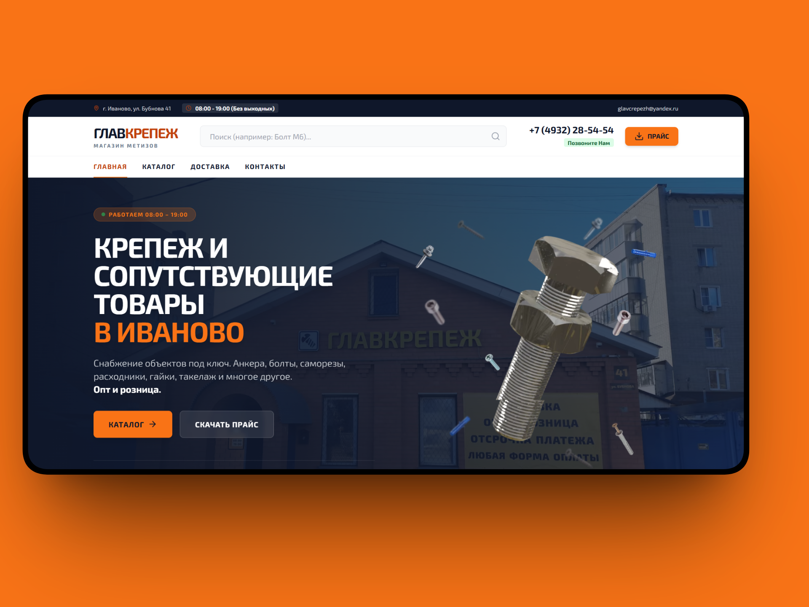
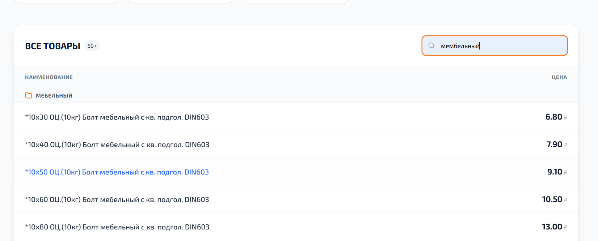
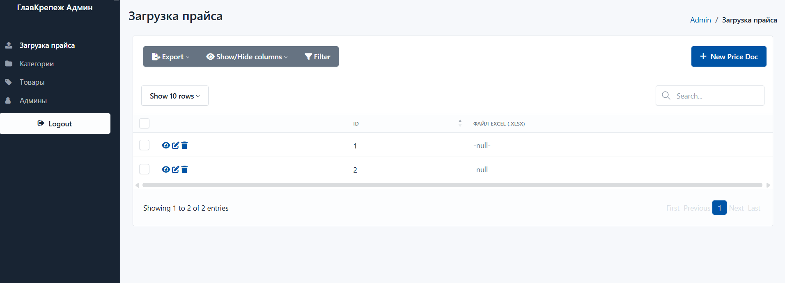
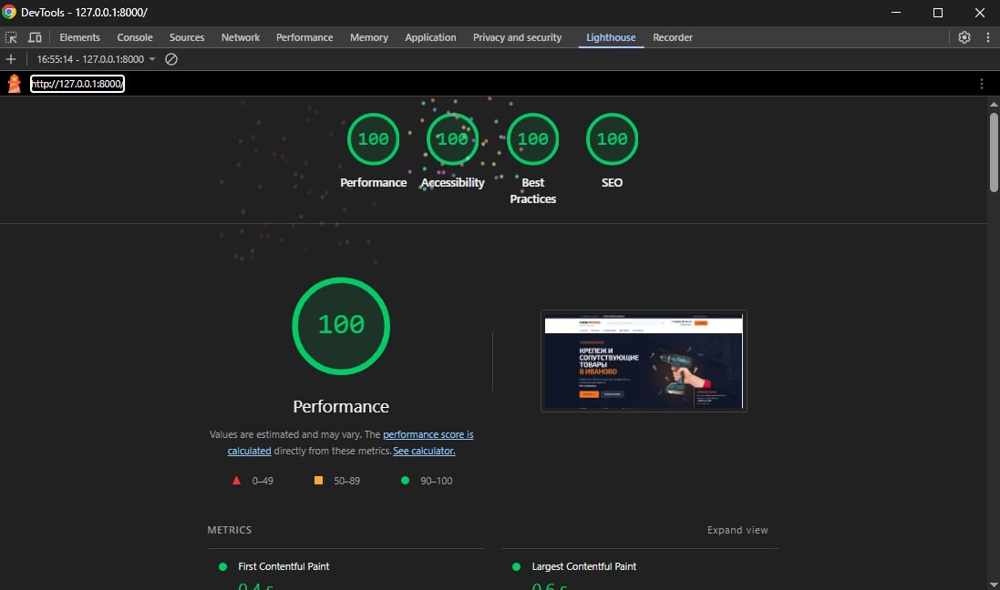

<div align="center">

  <h1>High-Performance B2B E-commerce Platform</h1>

  <p align="center">
    
    
    
    
    
    
    
  </p>

  

  <br>
  <br>

  <i>Архитектурное демо коммерческого проекта B2B-витрины (5000+ SKU)</i>
  <br><br>

</div>

> **Disclaimer:** Это архитектурное демо реального коммерческого проекта. Чувствительные бизнес-данные, ключи и проприетарная информация анонимизированы.

## Описание проекта
<!-- Далее идет текст из предыдущего варианта -->

## Описание проекта
Спроектирована и разработана автоматизированная B2B-витрина для оптово-розничного поставщика (5000+ SKU). Проект решает проблему медленного обновления каталогов и неэффективного поиска товаров со сложной номенклатурой. 

Архитектура построена по паттерну Modern Monolith (Server-Side Rendering + HTMX) для обеспечения максимальной скорости загрузки (LCP < 1s) на мобильных устройствах и бесшовного SEO-индексирования.

## Ключевые инженерные решения

### 1. Smart Data Pipeline (Excel-to-DB)
Разработан кастомный модуль на базе `Pandas` и `OpenPyXL` для обработки прайс-листов сложной структуры.
*   **Результат:** Время полного обновления каталога (цены, наличие, категории) сокращено с **16 часов до 5 секунд**.
*   Асинхронная загрузка и валидация данных через `Pydantic`.

### 2. Advanced Full-Text Search (PostgreSQL)
Стандартный `ILIKE` заменен на полнотекстовый поиск промышленного уровня.
*   Реализована связка **PostgreSQL FTS + `pg_trgm`** (триграммы).
*   Система толерантна к опечаткам (находит "болт" по запросу "блоот") и поддерживает морфологию русского языка. Внедрено ранжирование выдачи по релевантности.

### 3. Оптимизация иерархии (Recursive CTE)
Структура каталога подразумевает неограниченный уровень вложенности категорий.
*   Для извлечения деревьев категорий без N+1 запросов используется **Recursive CTE** на уровне базы данных (через `SQLAlchemy`).
*   Сложные выборки кэшируются, минимизируя нагрузку на БД.

## Технический стек

*   **Backend:** Python 3.12, FastAPI, SQLAlchemy 2.0, Alembic, Pydantic
*   **Data Processing:** Pandas, OpenPyXL
*   **Database:** PostgreSQL 15
*   **Frontend:** HTMX, Alpine.js, TailwindCSS, Jinja2
*   **Infrastructure:** Docker, Docker Compose, Nginx, Linux (VPS)
*   **Package Management:** uv

## Скриншоты и результаты

| Интерфейс | Описание |
|---|---|
|  | **Интеллектуальный поиск** — Демонстрация работы `pg_trgm` на запросах с опечатками. |
|  | **Панель управления** — Загрузка прайсов и статистика парсера. |
|  | **Lighthouse 100/100** — Оценка производительности (Performance, SEO, Best Practices). |

## Локальное развертывание

Проект упакован в контейнеры. Для запуска требуются `Docker` и `Docker Compose`.

1. Клонируйте репозиторий:
```bash
git clone https://github.com/your-username/b2b-ecommerce-fastapi.git
cd b2b-ecommerce-fastapi
```

2. Настройте переменные окружения:
```bash
cp .env.example .env
# Отредактируйте .env при необходимости
```

3. Запустите контейнеры:
```bash
docker-compose up -d --build
```

4. Примените миграции базы данных:
```bash
docker-compose exec web alembic upgrade head
```

*   Веб-интерфейс: `http://localhost`
*   Swagger API Docs: `http://localhost/docs`

## Лицензия
MIT